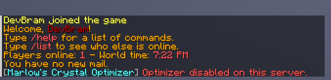
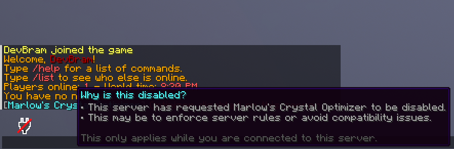

<div align="center">
  <h1>Marlow's Crystal Optimizer</h1>
  
  
  <br>
  <a href="https://modrinth.com/mod/marlow-crystal-optimizer"></a>
  <a href="https://discord.deathmotion.com"></a>
  <br>
  <h2>Showcase Video</h2>

[](https://www.youtube.com/watch?v=CcFT5KuQoZk)
</div>

## Overview

Marlow's Crystal Optimizer is a mod that optimizes the handling of using end crystals by removing the crystal client
side,
instead of waiting for the server to remove it. This can especially be useful when you are on higher ping.

### Prerequisites

Marlow's Crystal Optimizer requires different minimum Fabric Loader versions depending on the Minecraft version you are
using:

* **Minecraft 1.19 – 1.21.4:** Requires **Fabric Loader `0.16.5` or newer**
* **Minecraft 1.21.5 – 1.21.10:** Requires **Fabric Loader `0.16.10` or newer**
* **Minecraft 1.21.11 and above:** Requires **Fabric Loader `0.17.3` or newer**

Make sure you have the correct Fabric Loader version installed to ensure full compatibility.

## Table of Contents

- [Overview](#overview)
    - [Prerequisites](#prerequisites)
- [Supported Platforms & Versions](#supported-platforms--versions)
- [Installation](#installation)
- [Opt-Out Support](#opt-out-support)
    - [Plugin Messaging Protocol](#plugin-messaging-protocol)
    - [Example Implementation (PacketEvents)](#example-implementation-packetevents)
    - [Client side opt-out showcase](#client-side-opt-out-showcase)
- [Compiling From Source](#compiling-from-source)
    - [Prerequisites](#prerequisites)
    - [Steps](#steps)
- [License](#license)

## Supported Platforms & Versions

| Platform | Supported Versions |
|----------|--------------------|
| Fabric   | 1.19 - 1.21.11     |

## Installation

1. **Download**: Get the latest release from
   the [GitHub release page](https://github.com/Bram1903/MarlowsCrystalOptimizer/releases/latest).
2. **Install**: Place the mod in your `mods` folder, located in your `.minecraft` directory (`%appdata%`).
3. **Launch**: Start the game with the Fabric Loader profile.

## Opt-out Support

If you are running a server and wish to prevent this mod from being used, you can send an opt-out packet to the client.
This will disable the mod for the duration of the connection. The opt-out must be sent again after a server switch.

### Plugin Messaging Protocol

This protocol is used to negotiate client opt-out support between the client mod and the server.

#### Handshake (v1.0.5+)

| Step | Direction       | Channel                     | Payload                          |
|-----:|-----------------|-----------------------------|----------------------------------|
|    1 | Client → Server | `minecraft:register`        | Includes `marlowcrystal:opt_out` |
|    2 | Server → Client | `marlowcrystal:opt_out`     | Empty                            |
|    3 | Client → Server | `marlowcrystal:opt_out_ack` | Empty                            |

#### Legacy Clients (pre-1.0.5)

| Channel         | Direction       | Description            |
|-----------------|-----------------|------------------------|
| `minecraft:mco` | Client → Server | Legacy opt-out message |

This channel is **not part of the active protocol**.
When received, the server should disconnect the player and instruct them to update to **version 1.0.5 or newer**.

### Example Implementation (PacketEvents)

```java
private static final String REGISTER_CHANNEL = "minecraft:register";
private static final String OPT_OUT_CHANNEL = "marlowcrystal:opt_out";
private static final String OPT_OUT_ACK_CHANNEL = "marlowcrystal:opt_out_ack";

@Override
public void onPacketReceive(PacketReceiveEvent event) {
    PacketTypeCommon type = event.getPacketType();

    if (type == PacketType.Play.Client.PLUGIN_MESSAGE) {
        WrapperPlayClientPluginMessage packet = new WrapperPlayClientPluginMessage(event);
        handlePluginMessage(packet.getChannelName(), packet.getData());
    } else if (type == PacketType.Configuration.Client.PLUGIN_MESSAGE) {
        WrapperConfigClientPluginMessage packet = new WrapperConfigClientPluginMessage(event);
        handlePluginMessage(packet.getChannelName(), packet.getData());
    }
}
```

```java
private void handlePluginMessage(String channel, byte[] data) {
    if (REGISTER_CHANNEL.equals(channel)) {
        handleRegister(data);
        return;
    }

    if (OPT_OUT_ACK_CHANNEL.equals(channel)) {
        // Client has acknowledged the opt-out
    }
}
```

```java
private void handleRegister(byte[] data) {
    String payload = new String(data, StandardCharsets.UTF_8);

    for (String entry : payload.split("\0")) {
        if (!OPT_OUT_CHANNEL.equals(entry)) {
            continue;
        }
        
        // Make sure you create and send this packet asynchronously!
        player.getUser().sendPacket(new WrapperPlayServerPluginMessage(OPT_OUT_CHANNEL, new byte[0]));
        break;
    }
}
```

### Client side opt-out showcase

The client side opt-out message is only shown the first time the player joins the server after starting the game.





## Compiling From Source

### Prerequisites

- Java Development Kit (JDK) 21 or higher
- [Git](https://git-scm.com/downloads)

### Steps

1. **Clone the Repository**:
   ```bash
   git clone https://github.com/Bram1903/MarlowsCrystalOptimizer.git
   ```
2. **Navigate to the Project Directory**:
   ```bash
   cd MarlowsCrystalOptimizer
   ```
3. **Compile the Source Code**:
   Use the Gradle wrapper to build the plugin:

   <details>
   <summary><strong>Linux / macOS</strong></summary>

   ```bash
   ./gradlew build
   ```
   </details>
   <details>
   <summary><strong>Windows</strong></summary>

   ```cmd
   .\gradlew build
   ```
   </details>

## License

This project is licensed under the [MIT License](LICENSE).
