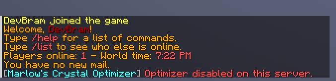
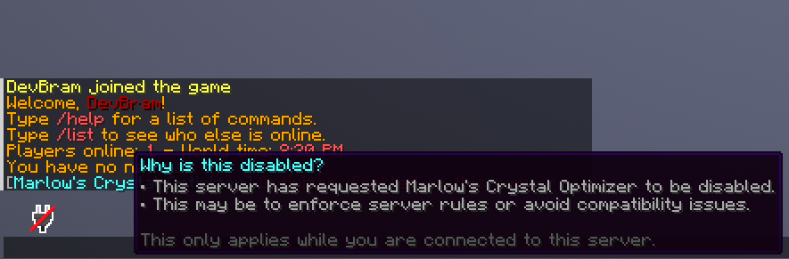

<div align="center">
  <h1>Marlow's Crystal Optimizer</h1>
  
  
  <br>
  <a href="https://modrinth.com/mod/marlow-crystal-optimizer"></a>
  <a href="https://www.curseforge.com/minecraft/mc-mods/marlow-crystal-optimizer"></a>
  <a href="https://discord.deathmotion.com"></a>
  <br>
  <h2>Showcase Video</h2>

[](https://www.youtube.com/watch?v=CcFT5KuQoZk)
</div>

## Overview

Marlow's Crystal Optimizer is a mod that optimizes the handling of using end crystals by removing the crystal client
side,
instead of waiting for the server to remove it. This can especially be useful when you are on higher ping.

### Prerequisites

Marlow's Crystal Optimizer requires different minimum Fabric Loader versions depending on the Minecraft version you are
using:

* **Minecraft 1.19 – 1.21.4:** Requires **Fabric Loader `0.16.5` or newer**
* **Minecraft 1.21.5 – 1.21.10:** Requires **Fabric Loader `0.16.10` or newer**
* **Minecraft 1.21.11:** Requires **Fabric Loader `0.17.3` or newer**
* **Minecraft 26.1 – 26.2:** Requires **Fabric Loader `0.18.4` or newer**
* **Minecraft 26.3 and above:** Requires **Fabric Loader `0.19.3` or newer**

Make sure you have the correct Fabric Loader version installed to ensure full compatibility.

## Table of Contents

- [Overview](#overview)
    - [Prerequisites](#prerequisites)
- [Supported Platforms & Versions](#supported-platforms--versions)
- [Installation](#installation)
- [Optional Integrations](#optional-integrations)
- [Opt-Out Support](#opt-out-support)
    - [Client side opt-out showcase](#client-side-opt-out-showcase)
- [Compiling From Source](#compiling-from-source)
    - [Prerequisites](#prerequisites)
    - [Steps](#steps)
- [Releasing](#releasing)
    - [Dry run](#dry-run)
- [License](#license)

## Supported Platforms & Versions

| Platform | Supported Versions |
|----------|--------------------|
| Fabric   | 1.19 - 26.3        |

## Installation

1. **Download**: Get the latest release from
   the [GitHub release page](https://github.com/Bram1903/MarlowsCrystalOptimizer/releases/latest).
2. **Install**: Place the mod in your `mods` folder, located in your `.minecraft` directory (`%appdata%`).
3. **Launch**: Start the game with the Fabric Loader profile.

## Optional Integrations

Both mods are optional.

| Mod                                                  | Adds                                                  | Minecraft |
|------------------------------------------------------|-------------------------------------------------------|-----------|
| [Mod Menu](https://modrinth.com/mod/modmenu)         | Update badge in the mod list                          | 1.20.5+   |
| [YetAnotherConfigLib](https://modrinth.com/mod/yacl) | Settings screen, needs Mod Menu                        | 1.20.2+   |

The update check only runs when Mod Menu asks for it, once per session. Modrinth is the default source and only offers
releases for your Minecraft version. GitHub follows the latest release.

Keep Render leaves a broken crystal visible until the server removes it. It stops blocking the crosshair and the next
placement straight away. It is off by default.

Settings are stored in `config/marlowcrystal.json`, as `updateSource` and `keepRender`.

## Opt-Out Support

Servers can disable the optimizer for a connection. Channels and payloads are documented in [PROTOCOL.md](PROTOCOL.md).

### Client side opt-out showcase

The client side opt-out message is shown once per connection.





## Compiling From Source

All supported Minecraft versions are built from this one branch. [Stonecutter](https://stonecutter.kikugie.dev/)
resolves the per-version differences at build time, so there is no branch to switch.

### Prerequisites

- Java Development Kit (JDK) 21 or higher
- [Git](https://git-scm.com/downloads)

### Steps

1. **Clone the Repository**:
   ```bash
   git clone https://github.com/Bram1903/MarlowsCrystalOptimizer.git
   ```
2. **Navigate to the Project Directory**:
   ```bash
   cd MarlowsCrystalOptimizer
   ```
3. **Build every supported version**:
   Jars are written to `build/libs/`, one per supported Minecraft range.

   <details>
   <summary><strong>Linux / macOS</strong></summary>

   ```bash
   ./gradlew buildAndCollect
   ```
   </details>
   <details>
   <summary><strong>Windows</strong></summary>

   ```cmd
   .\gradlew buildAndCollect
   ```
   </details>

### Working on a single version

`src/` is shown for one Minecraft version at a time. Switch which one with the
`Set active project to ...` Gradle task, and run `Reset active project` before committing.
To build just one, use `./gradlew 1.21.5:build`.

Supported versions and their compatibility ranges are declared in `stonecutter.properties.toml`.
That file is the single source of truth: it drives the jar name, the `depends.minecraft` range in
`fabric.mod.json`, and the release targets.

Shared build conventions live in `build-logic`. `build.gradle.kts` only holds the Minecraft and Loom setup.

## Releasing

Publishing is a Gradle task rather than a CI job.

1. Set `mod.version` in `stonecutter.properties.toml`. A version ending in `-SNAPSHOT` is published as a beta.
2. Head `CHANGELOG.md` with that version. It becomes the release notes on every platform and in Discord.
3. Set the four environment variables below. If any of them is missing, nothing is uploaded. The setup script
   opens the page to create each one, checks what you paste, and stores it for new terminals:
   ```bash
   ./scripts/setup-publishing.sh
   ```
   ```powershell
   powershell -ExecutionPolicy Bypass -File scripts\setup-publishing.ps1
   ```
4. Run `./gradlew publishMods`.

| Variable | Used for | How to get it |
|----------|----------|---------------|
| `GITHUB_TOKEN` | The GitHub release and every jar attached to it | A [fine-grained token](https://github.com/settings/personal-access-tokens/new) for this repository with *Contents: Read and write*, or the output of `gh auth token` |
| `MODRINTH_TOKEN` | One Modrinth version per supported range | A [personal access token](https://modrinth.com/settings/pats) with *Create versions*, *Read versions* and *Write versions* |
| `CURSEFORGE_TOKEN` | One CurseForge file per supported range | An [API token](https://authors-old.curseforge.com/account/api-tokens) |
| `DISCORD_WEBHOOK` | The release announcement | A webhook URL, created under the channel's *Integrations* settings |

The Minecraft versions each Modrinth and CurseForge upload is tagged with come from `mod.mc_releases` in
`stonecutter.properties.toml`.

### Dry run

Set `MCO_PUBLISH_DRY_RUN` to any value to print what would be published without uploading anything. A dry run
needs none of the variables above.

```bash
MCO_PUBLISH_DRY_RUN=1 ./gradlew publishMods
```

To preview the Discord announcement, also set `DISCORD_WEBHOOK_DRY_RUN` to a webhook for a test channel. Its
Modrinth and CurseForge links are placeholders, because those only exist after a real upload.

## License

This project is licensed under the [MIT License](LICENSE).
